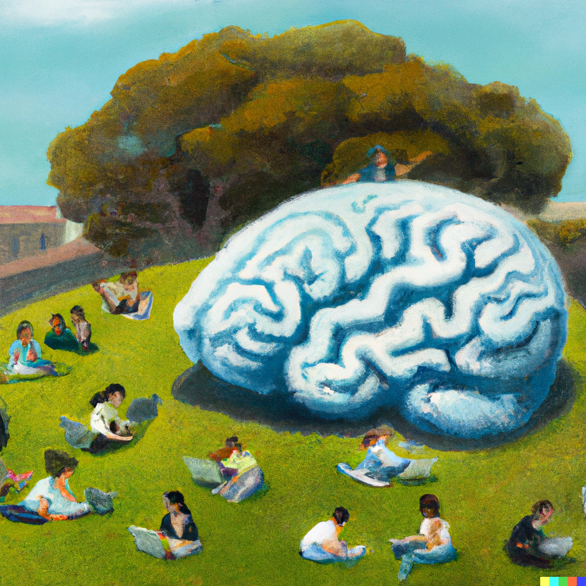

# Psych 290Q Online Experiments for Psychologists

UC Berkeley Cognition Seminar, Spring 2023, 2 Units

- Tu & Thu 3pm - 4pm Berkeley Way West 1213
- Instructor: Bill Thompson [wdt@berkeley.edu](mailto:wdt@berkeley.edu)
- Office hours: Friday 3pm - 4pm, 3rd Floor BWW or Zoom, Sign up for a slot here: [Google calendar](https://calendar.app.google/DAvThSyG4rzFbwET9)
- Course website: [github.com/ecl-ucb/290Q](https://github.com/ecl-ucb/290Q)
- bCourses site: [290Q bCourses](https://bcourses.berkeley.edu/courses/1522687)
- In the course catalogue: [classes.berkeley.edu](https://classes.berkeley.edu/content/2023-spring-psych-290q-001-sem-001)
- Course project due: Friday April 28th [tentative]

## Course Description
A practical introduction to web-based behavioral experiments. We will learn to build experiments using [JsPsych](https://www.jspsych.org/7.3/), a JavaScript framework for creating experiments that run in a web browser. The goal of this course is for each student to create a new experiment that furthers their research. 

First, we will cover relevant basics of HTML and JavaScript and the core functionality of JsPsych. Next, we will cover more advanced experimental designs (e.g. custom tasks, dynamically structured procedures). Finally, we will learn how to host a JsPsych experiment using [Dallinger](https://github.com/Dallinger/Dallinger) and deploy the experiment to online recruitment platforms such as [Prolific](https://www.prolific.co/) or [Amazon’s Mechanical Turk](https://www.mturk.com/). 

The course is primarily lab-based and goal-oriented. Minimal required work outside of class. May include occasional readings relating to the merits and limitations of web-based experimental methods. The primary assessment is a course project – the design and implementation of a working experiment you would like to run. I may ask people to submit short code-based check-in assignments along the way.

## Lab Sessions
Each lab session, I will introduce a notebook containing jsPsych code. You will then read through the code, copy it into a file on your computer, run it, and potentially edit it. Lab sessions from 03/21 onwards will involve writing your own code to create your experiment.

**Please bring your own laptop to class**. 
If this is not practical for you, let me know and I will be happy to arrange an alternative.

## Schedule
The schedule below is tentative.

| Date       | Day | Topic                                | Class Materials |
| ---------- | --- | ------------------------------------ | --------------- |
| 01/17/2023 | Tue | Course Introduction                  | Lab 1: [welcome.md](assets/labs/L1-course-intro/welcome.md) |
| 01/19/2023 | Thu | Developer Tools and HTML Basics      | Lab 2: [tools-and-html.md](assets/labs/L2-intro-html/tools-and-html.md) |
| 01/24/2023 | Tue | Javascript Basics (Part 1)           | Lab 3: [javascript-basics-1.md](assets/labs/L3-intro-javascript-1/javascript-basics-1.md) |
| 01/26/2023 | Thu | Javascript Basics (Part 2)           | Lab 4: [javascript-basics-2.md](assets/labs/L4-intro-javascript-2/javascript-basics-2.md) ||
| 01/31/2023 | Tue | Creating an experiment with jspsych  | Lab 5: [intro-jsPsych.md](assets/labs/L5-intro-jsPsych/intro-jsPsych.md) |
| 02/02/2023 | Thu | Catch-up lab                         |                 |
| 02/07/2023 | Tue | Building a timeline (Part 1: grouping, looping, and skipping trials)         | Lab 7: [timeline-1.md](assets/labs/L7-timeline-1/timeline-1.md) |
| 02/09/2023 | Thu | Building a timeline (Part 2: timeline variables)         | Lab 8: [timeline-2.md](assets/labs/L8-timeline-2/timeline-2.md) |
| 02/14/2023 | Tue | Plugins (Part 1: the anatomy of a plugin)                     | Lab 9: [plugins-1.md](assets/labs/L9-plugins-1/plugins-overview.md) |
| 02/16/2023 | Thu | Plugins (Part 2: creating a new plugin)                     | Lab 10: [plugins-2.md](assets/labs/L10-plugins-2/plugins-2.md)                |
| 02/21/2023 | Tue | Catch-up lab                         |                 |
| 02/23/2023 | Thu | Catch-up lab                         |                 |
| 02/28/2023 | Tue | Interacting with jsPsych Data |                 |
| 03/02/2023 | Thu | Saving data to [OSF](https://osf.io/) using [Datapipe](https://pipe.jspsych.org/)         |                 |
| 03/07/2023 | Tue | Experimental Design        |                 |
| 03/09/2023 | Thu | Experiment-level Settings and Events |                 |
| 03/14/2023 | Tue | TBD                         |                 |
| 03/16/2023 | Thu | TBD                         |                 |
| 03/21/2023 | Tue | Planning Week: your experiment       |                 |
| 03/23/2023 | Thu | Planning Week: your experiment       |                 |
| 03/28/2023 | Tue | Spring Recess                        |                 |
| 03/30/2023 | Thu | Spring Recess                        |                 |
| 04/04/2023 | Tue | Hosting an experiment online         |                 |
| 04/06/2023 | Thu | Hosting an experiment online         |                 |
| 04/11/2023 | Tue | Interacting with prolific/mturk      |                 |
| 04/13/2023 | Thu | Interacting with prolific/mturk      |                 |
| 04/18/2023 | Tue | Building your experiement            |                 |
| 04/20/2023 | Thu | Building your experiement            |                 |
| 04/25/2023 | Tue | Building your experiement            |                 |
| 04/27/2023 | Thu | Building your experiement            |                 | 

## Assessments 

### Course Project
Build an experiment that contributes to your research. Due at the end of the course, probably Friday 28th April. I will be your first participant (unless your experiment is really long): submit code that I can run, and a single page text summary of your experiment. More details to follow.
**Grade Proportion**: 75%

### Attendance, Engagement, Peer Support
This is a practical lab-based course. Please try to attend the lab sessions. Think of this class as a collective learning enterprise. Even expert coders get stuck: helping your fellow students solve problems and find bugs is a great way to improve your own learning as well as other people's and to keep the class moving on schedule. 
**Grade Proportion**: 25%   

## Potential Readings

### Games and Gamification

[How games can make behavioural science better](https://www.nature.com/articles/d41586-023-00065-6)

### Data Quality Online

[Data quality of platforms and panels for online behavioral research](https://link.springer.com/article/10.3758/s13428-021-01694-3)

[Prolific's Attention and Comprehension Check Policy](https://researcher-help.prolific.co/hc/en-gb/articles/360009223553-Prolific-s-Attention-and-Comprehension-Check-Policy)

### Designing Experiments and Open Science

[Experimentology: An Open Science Approach to Experimental Psychology Methods](https://experimentology.io/)

## Acknowledgements
Substantial inspiration from the [JsPsych Tutorials](https://www.jspsych.org/7.0/tutorials/hello-world/) and from [Kenny Smith](http://www.lel.ed.ac.uk/~kenny/)'s Course [Online Experiments for Language Scientists](https://kennysmithed.github.io/oels2022/). 