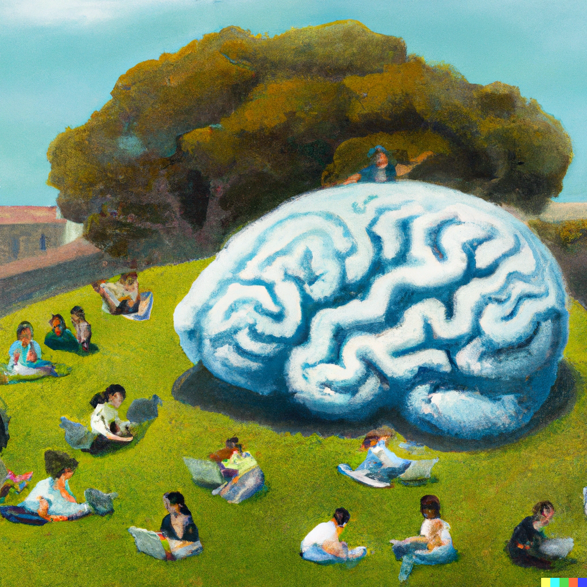

# Online Experiments for Psychologists

Welcome to Psych 290Q Cognition Seminar Spring 2023

## Logistics

- **Where?** Berkeley Way West 1213
- **When?** Tu & Thu 3pm - 4pm 
- **Instructor** Bill Thompson [wdt@berkeley.edu](mailto:wdt@berkeley.edu)
- **Office hours** Friday 3pm - 4pm, 3rd Floor BWW atrium or Zoom, Sign up for a slot here: [Google calendar](https://calendar.app.google/DAvThSyG4rzFbwET9)
- **Course website** [ecl-ucb.github.com/290Q](ecl-ucb.github.com/290Q)
- **bCourses site** [290Q bCourses](https://bcourses.berkeley.edu/courses/1522687)
- **In the course catalogue** [classes.berkeley.edu](https://classes.berkeley.edu/content/2023-spring-psych-290q-001-sem-001)
- **Course project due**: Friday **April 28th** [tentative]

## Course Description
A practical introduction to web-based behavioral experiments. We will learn to build experiments using [JsPsych](https://www.jspsych.org/7.3/), a JavaScript framework for creating experiments that run in a web browser. The goal of this course is for **each student to create a new experiment that furthers their research**. 

- The course is **primarily lab-based and goal-oriented** 
- **Minimal required work outside of class**. Can include occasional readings if people are interested, probably about merits/limits of online data collection. 
- The primary assessment is a course project (more below)

## Lab Sessions

**Please bring your own laptop to class**. 
If this is not practical for you, let me know and I will be happy to arrange an alternative.

- **I will**: introduce a notebook containing jsPsych code. 
- **You will**: read through the code, copy it into a file on your computer, run it, and potentially edit it. 
- Lab sessions from 03/21 onwards will involve writing your own code to create your experiment.

## Learning Goals

By the end of this course, you will have learned to make behavioral experiments.

**Core goals:**

- Create browser-based behavioral experiments using [jsPsych](https://www.jspsych.org/7.3/)
- Write basic html and javascript code relevant to experimental stimuli and procedure

**Stretch goals:**

- Host a jsPsych experiment online on a public-facing server
- Recruit participants online using crowd-sourcing platforms
- Create networked experiments by combining jsPsych and [Dallinger](https://github.com/Dallinger/Dallinger)

## Schedule
The schedule below is tentative.

| Date       | Day | Topic                                | Class Materials |
| ---------- | --- | ------------------------------------ | --------------- |
| 01/17/2023 | Tue | Course Introduction                  | Lab 1: [welcome.md](assets/labs/L1-course-intro/welcome.md) |
| 01/19/2023 | Thu | Developer Tools and HTML Basics      | Lab 2: [tools-and-html.md](assets/labs/L2-intro-html/tools-and-html.md) |
| 01/24/2023 | Tue | Javascript Basics (Part 1)           | |
| 01/26/2023 | Thu | Javascript Basics (Part 2)           | |
| 01/31/2023 | Tue | Creating an experiment with jspsych  |                 |
| 02/02/2023 | Thu | Catch-up lab                         |                 |
| 02/07/2023 | Tue | Building a timeline (Part 1)         |                 |
| 02/09/2023 | Thu | Building a timeline (Part 2)         |                 |
| 02/14/2023 | Tue | Plugins (Part 1)                     |                 |
| 02/16/2023 | Thu | Plugins (Part 2)                     |                 |
| 02/21/2023 | Tue | Catch-up lab                         |                 |
| 02/23/2023 | Thu | Catch-up lab                         |                 |
| 02/28/2023 | Tue | Dynamic parameters                   |                 |
| 03/02/2023 | Thu | Data: Interaction and storage        |                 |
| 03/07/2023 | Tue | Data: Interaction and storage        |                 |
| 03/09/2023 | Thu | Experiment-level Settings and Events |                 |
| 03/14/2023 | Tue | Catch-up lab                         |                 |
| 03/16/2023 | Thu | Catch-up lab                         |                 |
| 03/21/2023 | Tue | Planning Week: your experiment       |                 |
| 03/23/2023 | Thu | Planning Week: your experiment       |                 |
| 03/28/2023 | Tue | Spring Recess                        |                 |
| 03/30/2023 | Thu | Spring Recess                        |                 |
| 04/04/2023 | Tue | Hosting an experiment online         |                 |
| 04/06/2023 | Thu | Hosting an experiment online         |                 |
| 04/11/2023 | Tue | Interacting with prolific/mturk      |                 |
| 04/13/2023 | Thu | Interacting with prolific/mturk      |                 |
| 04/18/2023 | Tue | Building your experiement            |                 |
| 04/20/2023 | Thu | Building your experiement            |                 |
| 04/25/2023 | Tue | Building your experiement            |                 |
| 04/27/2023 | Thu | Building your experiement            |                 | 

## Teaching philosophy

I hope that this course will: 

- Contribute to your research 
- Not take up a lot of your time outside of class
- Generate research collaborations

Teaching plan designed to accommodate differing levels of experience:

- Generally, we will do one topic per week, split over two labs.
- Tuesday lab **everyone tries to attend**, Thursday lab if you need / want the extra time. 
- Schedule includes planned catch-up labs

**Coding:** This is a goal-oriented coding course, not a comprehensive course in javascript and html. I will teach you the basic HTML and javascript you need to know to be able to create experiments. There will be a lot that we don't cover. My aim is provide you with the tools you need to get started and to be able to learn whatever extra stuff you need at your own pace.    

**Debugging:** 75% of being a productive coder is becoming comfortable googling how to do something you don't know how to do. There will be *a lot* of things I don't know the answer to. [Stack overflow](https://stackoverflow.com/) is our guiding light. 

**If you want to get ahead**: 

- [HTML tutorials](https://www.w3schools.com/html/)
- Javascript Tutorials: [start here](https://javascript.info/hello-world)
- [JsPsych Tutorials](https://www.jspsych.org/7.0/tutorials/hello-world/)

**If you already know Javascript/jsPsych:**

- Use early lab sessions to start working on your experiment
- Learn and integrate more advanced jsPsych functionality into your experiments
- Create tutorial materials for your peers :)
- Start learning Dallinger and working on an integration of jsPsych with Dallinger. Talk to me if you want to do something like this.

## Assessments 

### Course Project
Build an experiment that contributes to your research. Due at the end of the course, probably Friday 28th April. I will be your first participant (unless your experiment is really long): submit code that I can run, and a single page text summary of your experiment. More details to follow.
**Grade Proportion**: 75%

### Attendance, Engagement, Peer Support
This is a practical lab-based course. Please try to attend the lab sessions. Think of this class as a collective learning enterprise. Even expert coders get stuck: helping your fellow students solve problems and find bugs is a great way to improve your own learning as well as other people's and to keep the class moving on schedule. 
**Grade Proportion**: 25%   

## Acknowledgements
Substantial inspiration from the [JsPsych Tutorials](https://www.jspsych.org/7.0/tutorials/hello-world/) and from [Kenny Smith](http://www.lel.ed.ac.uk/~kenny/)'s Course [Online Experiments for Language Scientists](https://kennysmithed.github.io/oels2022/). 

