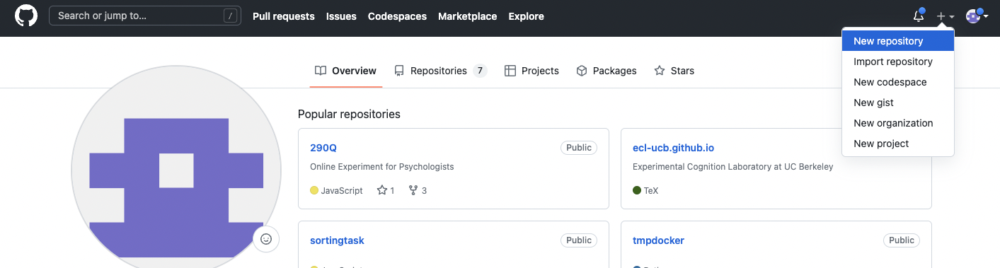
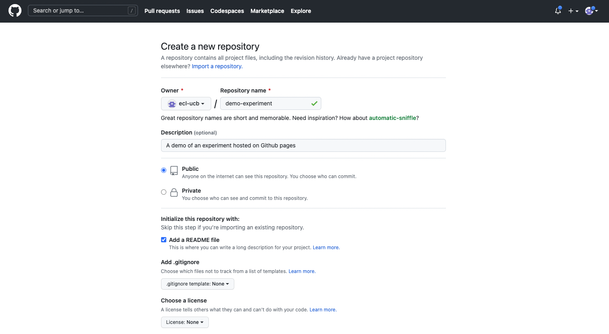
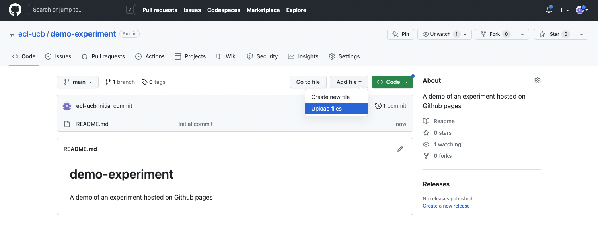
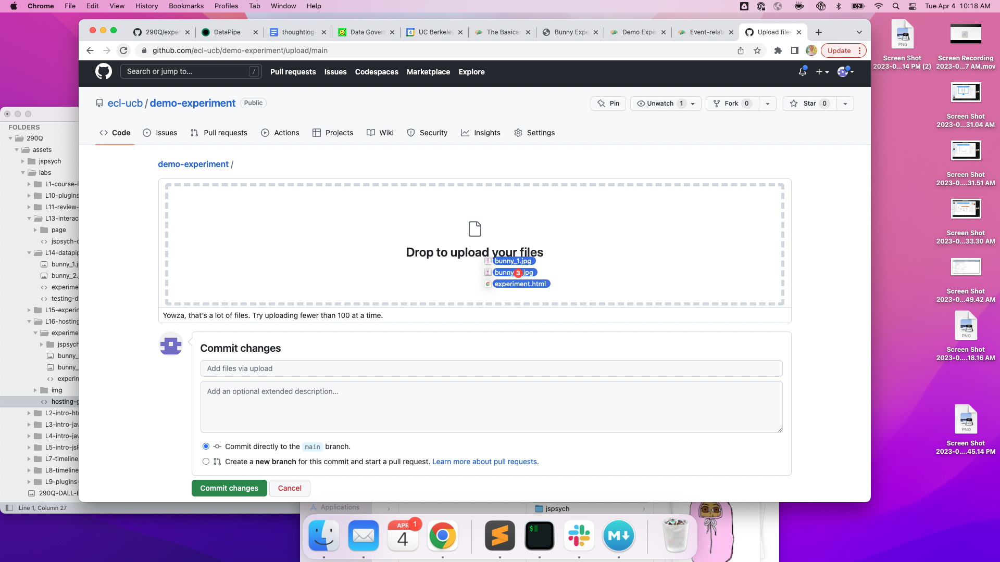
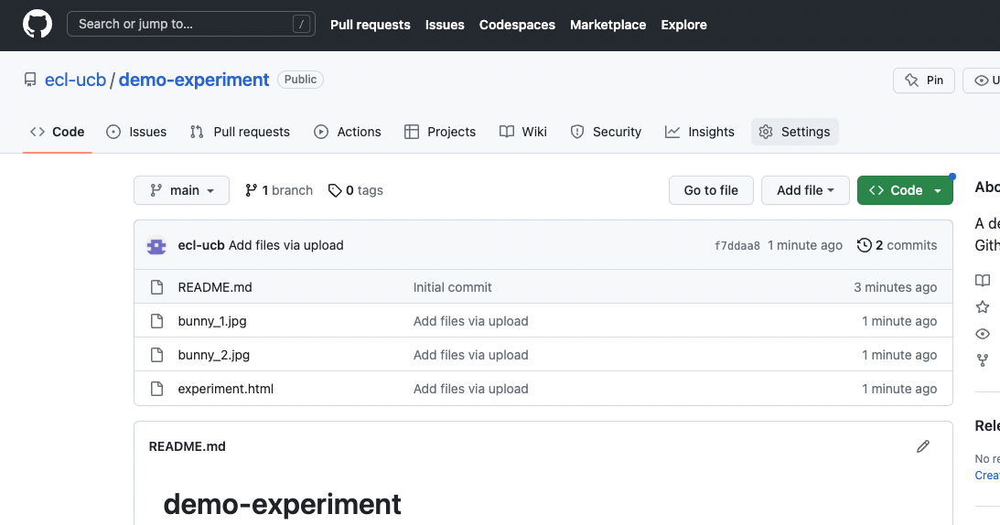
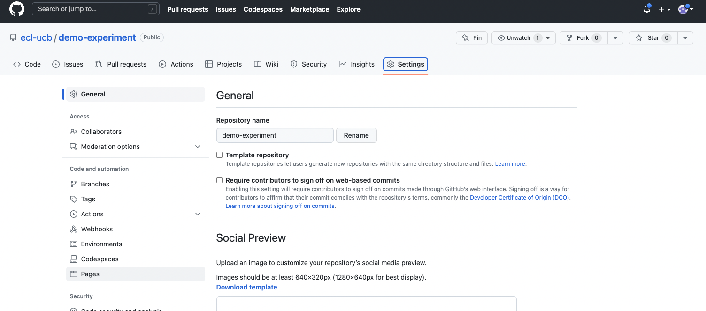
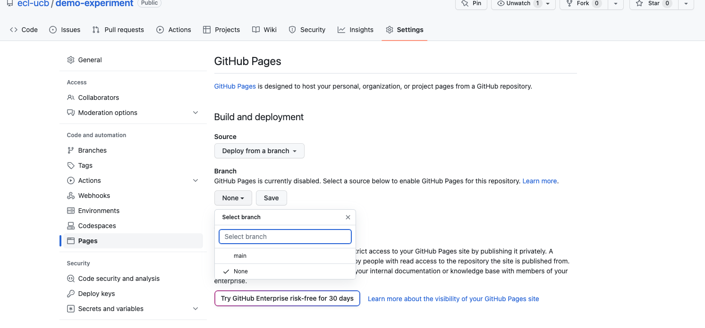
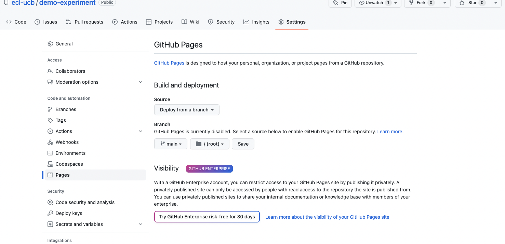

# Hosting your experiment online using Github Pages

For participants to access your experiment, it needs to be hosted on server and accessible via a url. There are many ways to do this (see e.g. [psiturk](https://psiturk.org/), [pushkin](https://languagelearninglab.gitbook.io/pushkin/), [heroku](https://www.heroku.com/platform)). 

One particularly simple method is to use Github to host your experiment directly, using [Github Pages](https://pages.github.com/) (no prior experieince with Git or Github is needed for this class).

Github is a platform for hosting code, so many scientists use github to make their analysis scripts openly available for example. Developers use Github to store and collaborate on code by committing it to a *repository*. There are many wonderful uses of Github in Science and Technology, but we will use it for the specific pupose of hosting an experiment.

Github Pages is a great service to the community and a relatively recent feature. Github pages takes code stored in a Github repository and turns it into a website hosted on their servers, and provides a URL through which you can access the website. All at no cost to the user!  

Here are the steps you will need to go through to host an experiment this way. We will work through steps 1 - 4 below, using the Bunny experiment from lab 14 as an example.

0. Create a Github account
1. Create a new Github repository
2. Add experiment files to the repository
3. Enable Github Pages in the repository
4. Accessing the experiment

## 1. Create a new Github repository

Log in to Github using your account, and click on the cross at the top right hand corner of the page to create a new repository. We will store our experiment files here.

You will need to choose a name for the repository (*repo*): I used demo-experiment but you can use anything. Note that whatever name you choose wikk appear in the URL you give participants.

The repository will likely need to be public. You can serve a Github Pages page from a private repo, but you need a paid account on github to do so at present. Public repositories can be accessed by anyone, so be careful not to commit any files that contain sensitive information. It doesn't matter whether you add a README (kind of like a flyer for the repo) or not: I generally add one.

## 2. Add experiment files to the repository

At a minimum, we need to add an html file to the repository that contains our jsPsych code. Here, I will also add two image files and a (bare-bones) copy of the jspsych library and plugins we need. 

Note: I removed everything except the exact scripts we need from the jspsych folder -- there were too many files to upload; an alternative option would be to import jspsych libraries from the web instead of uploading them into our repo directly.

So here's the structure of our `experiment` folder:

- `jspsych/`
- `experiment.html`
- `bunny_1.jpg` 
- `bunny_2.jpg` 

You can upload these files into your repo using the Github website, by clicking `add file` and selecting `upload-files`.

You can use the drag and drop functionality here to upload the files in our `experiment` directory (including the `jspsych` directory). If you are already familiar with Git, feel free to use other methods for comitting files into the repo.

All the files we need should now be in the repository.

## 3. Enable Github Pages for the repository

Once your files have been added, you need to tell the repository that we want it to serve a webpage using Github pages. To di that, click the `settings` tab on the repo page:

Within settings, go to the `Pages` tab on the left toolbar:

Under the `Branch` heading on the right, select `main`. Github pages is disabled by default: selecting `main` tells Github to serve a Github Pages oage from this particular `branch` of your repository -- learn more about `branches` [here](https://docs.github.com/en/pull-requests/collaborating-with-pull-requests/proposing-changes-to-your-work-with-pull-requests/about-branches) if you are interested (certainly not neccesary).

Finally, click Save.

## 4. Accessing the experiment

Allow github a minute or two to process your uploads. After a short time, your experiment should be visible as a webpage. The URL at which you can access the experiment works like this:

`github_username.io/repository_name/html_file_name.html`

With the relevant details substituted in. For example, my lab Github account username is `ecl-ucb`. The repository name is `demo-experiment`. And the html file we wish to access is `experiment.html`.

So the URL should be:

[ecl-ucb.github.io/demo-experiment/experiment.html](ecl-ucb.github.io/demo-experiment/experiment.html)

Clicking that link should load the experiment! FYI, you can delete a repository by going into the repository settings and scrolling all the way down to the *Danger Zone*.
